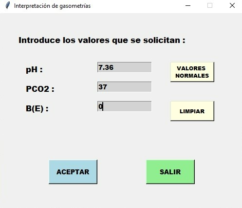
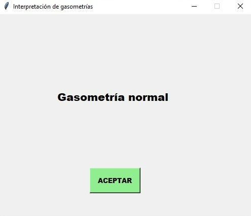

# Gasometrias
Se despliega una interfaz gráfica, programada con TKinter, para la interpretación de trastornos del metabolismo ácido-base.
En el Script se encuentra la bibliografía utilizada que sustenta el trabajo de interpretación de los trastornos del equilibrio ácido base.

Se despliega una pantalla como la siguiente:

Al seleccionar los valores y dar click en aceptar, obtenemos un diagnóstico:

